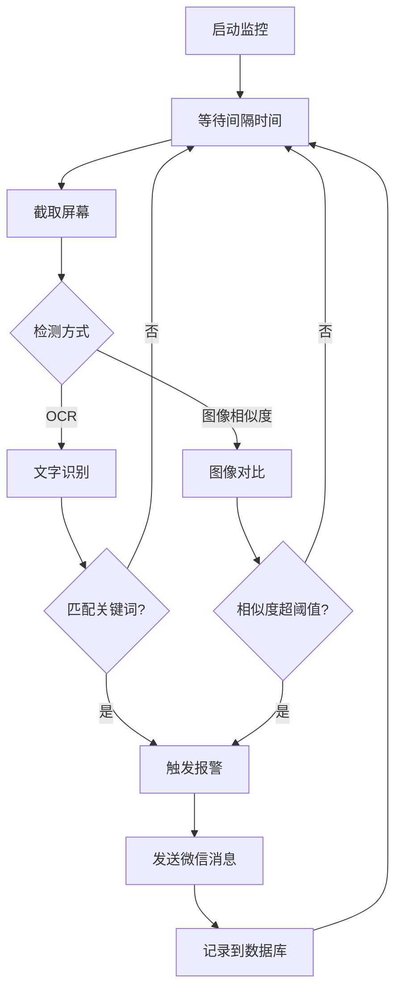
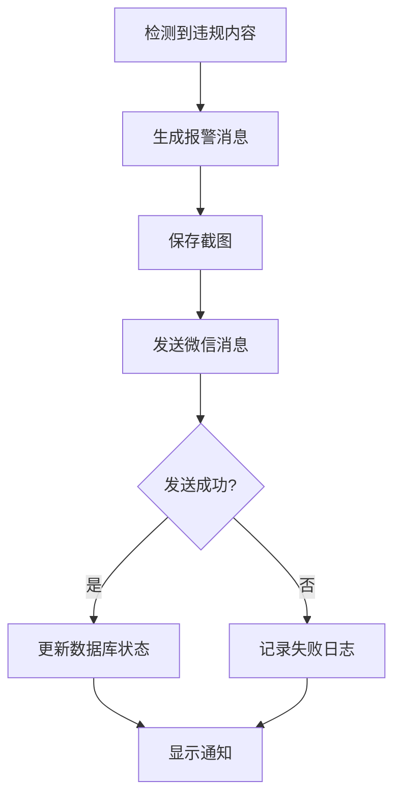

# Screen Monitor - 产品文档 (Product Documentation)

## 1. 项目概述 (Project Overview)

### 1.1 项目目标
开发一个跨平台的桌面屏幕监控应用，能够周期性地检测屏幕内容中的违规关键词（如"直播间违规"），并通过微信进行实时报警。

### 1.2 核心功能
- **用户认证系统**: 基于SQLite的本地登录认证
- **跨平台支持**: Windows和macOS桌面应用
- **智能屏幕监控**: 周期性截屏并进行OCR文字识别
- **关键词检测**: 支持多种检测方式（OCR文字识别、图像相似度对比）
- **微信报警**: 检测到违规内容后通过微信消息提醒
- **系统托盘集成**: 后台运行，不干扰正常工作

### 1.3 技术限制说明

> [!WARNING]
> **微信电话拨打功能限制**
> 
> 经过技术调研，目前**没有可靠的Python API能够直接拨打微信电话**。微信官方未提供此类API，第三方工具主要通过以下方式实现：
> - GUI自动化（模拟点击）- 不稳定且易被检测
> - 协议逆向工程 - 违反微信服务条款，存在封号风险
> 
> **替代方案**: 本项目将采用**微信消息推送**作为主要报警方式，这是更稳定、更可靠的解决方案。

## 2. 需求分析 (Requirements Analysis)

### 2.1 功能需求

#### 2.1.1 用户认证模块
- 本地SQLite数据库存储用户凭证
- 用户名/密码登录
- 记住登录状态（可选）
- 密码加密存储（使用bcrypt或类似算法）

#### 2.1.2 屏幕监控模块
- 可配置的监控间隔（30秒、1分钟、5分钟等）
- 全屏或指定区域截图
- 后台运行，不影响用户操作
- 监控状态实时显示

#### 2.1.3 内容检测模块
支持两种检测方式：

**方式一：OCR文字识别**
- 使用pytesseract或EasyOCR进行文字提取
- 关键词匹配（支持多个关键词）
- 支持中文识别

**方式二：图像相似度对比**
- 上传参考图片（违规内容示例）
- 使用图像哈希或特征匹配算法
- 设置相似度阈值

#### 2.1.4 报警模块
- 微信消息推送（使用itchat或python-wechaty）
- 报警内容包括：
  - 检测时间
  - 检测到的关键词
  - 截图缩略图
- 报警历史记录

#### 2.1.5 配置管理
- 监控间隔设置
- 关键词列表管理
- 参考图片管理
- 微信账号配置
- 报警接收人设置

### 2.2 非功能需求

#### 2.2.1 性能要求
- 截图处理时间 < 2秒
- OCR识别时间 < 3秒
- 内存占用 < 200MB（空闲状态）
- CPU占用 < 5%（空闲状态）

#### 2.2.2 可用性要求
- 界面简洁直观，易于操作
- 提供系统托盘快捷操作
- 启动时间 < 3秒

#### 2.2.3 兼容性要求
- Windows 10/11
- macOS 11.0+
- Python 3.8+

#### 2.2.4 安全性要求
- 密码加密存储
- 截图数据本地存储，定期清理
- 微信登录凭证安全存储

## 3. 技术选型 (Technology Stack)

### 3.1 选型原则
- ✅ 快速开发
- ✅ 简单robust框架
- ✅ 易部署调试
- ✅ 代码框架简单
- ✅ 跨平台兼容性好

### 3.2 核心技术栈

| 组件 | 技术选择 | 理由 |
|------|---------|------|
| **编程语言** | Python 3.8+ | 丰富的库支持，开发效率高 |
| **GUI框架** | PyQt5/PySide6 | 功能强大，跨平台，界面美观 |
| **数据库** | SQLite3 | 轻量级，无需额外安装，适合本地应用 |
| **OCR引擎** | pytesseract | 成熟稳定，支持中文，免费开源 |
| **备选OCR** | EasyOCR | 准确度更高，但速度较慢 |
| **图像处理** | Pillow (PIL) | 标准库，功能全面 |
| **屏幕截图** | pyautogui / mss | 跨平台，性能好 |
| **图像相似度** | imagehash | 简单高效的感知哈希算法 |
| **微信集成** | itchat | 简单易用，文档完善 |
| **系统托盘** | pystray | 跨平台系统托盘支持 |
| **打包工具** | PyInstaller | 跨平台，支持单文件打包 |
| **macOS打包** | py2app | macOS原生.app包 |

### 3.3 技术架构

```
┌─────────────────────────────────────────┐
│           GUI Layer (PyQt5)             │
│  ┌──────────┐  ┌──────────┐  ┌────────┐│
│  │ Login UI │  │ Main UI  │  │Settings││
│  └──────────┘  └──────────┘  └────────┘│
└─────────────────┬───────────────────────┘
                  │
┌─────────────────┴───────────────────────┐
│         Business Logic Layer            │
│  ┌──────────┐  ┌──────────┐  ┌────────┐│
│  │Auth Mgr  │  │Monitor   │  │Alert   ││
│  │          │  │Service   │  │Service ││
│  └──────────┘  └──────────┘  └────────┘│
└─────────────────┬───────────────────────┘
                  │
┌─────────────────┴───────────────────────┐
│          Data Access Layer              │
│  ┌──────────┐  ┌──────────┐  ┌────────┐│
│  │SQLite DB │  │Screenshot│  │Config  ││
│  │          │  │Storage   │  │Manager ││
│  └──────────┘  └──────────┘  └────────┘│
└─────────────────────────────────────────┘
```

### 3.4 依赖库清单

```python
# Core
PyQt5==5.15.10           # GUI框架
Pillow==10.1.0           # 图像处理

# Screen Capture & OCR
pyautogui==0.9.54        # 屏幕截图
mss==9.0.1               # 高性能截图（备选）
pytesseract==0.3.10      # OCR引擎
easyocr==1.7.1           # 备选OCR

# Image Analysis
imagehash==4.3.1         # 图像相似度
opencv-python==4.8.1.78  # 图像处理（可选）

# WeChat Integration
itchat==1.3.10           # 微信API

# System Tray
pystray==0.19.5          # 系统托盘

# Database & Security
bcrypt==4.1.2            # 密码加密

# Packaging
PyInstaller==6.3.0       # Windows打包
py2app==0.28.8           # macOS打包
```

## 4. 开源项目调研 (Open Source Research)

### 4.1 相关开源项目

#### 4.1.1 屏幕监控类
- **screen-ocr**: 专注于屏幕OCR的Python库，支持多后端
- **pyautogui**: 广泛使用的GUI自动化和截图工具
- **mss**: 高性能跨平台截图库

#### 4.1.2 微信自动化类
- **itchat**: 个人微信API，支持消息收发
- **python-wechaty**: 基于Wechaty生态的Python客户端
- **pywxclient**: 基于Web API的简单微信客户端

#### 4.1.3 桌面应用框架
- **PyQt5/PySide6**: 功能最全面的Python GUI框架
- **Tkinter**: Python标准库，简单但功能有限
- **Electron + Python**: Web技术栈，但资源占用大

### 4.2 可复用组件
- 使用现有的OCR库而非自己实现
- 使用成熟的微信API库
- 使用标准的打包工具

## 5. UI设计 (UI Design)

### 5.1 登录界面


**功能说明**:
- 简洁的登录卡片设计
- 用户名/密码输入
- 记住登录状态选项
- 渐变背景提升视觉效果

### 5.2 主界面


**功能模块**:
1. **顶部栏**: 用户信息、设置入口
2. **状态卡片**: 实时显示监控状态（运行/停止）
3. **配置面板**:
   - 监控间隔设置
   - 关键词管理
   - 微信报警配置
4. **报警日志**: 显示最近的检测记录
5. **操作按钮**: 启动/停止监控、查看日志

### 5.3 系统托盘菜单


**功能说明**:
- 快速查看监控状态
- 一键启动/停止监控
- 快速访问主要功能
- 退出应用

## 6. 数据库设计 (Database Schema)

### 6.1 用户表 (users)
```sql
CREATE TABLE users (
    id INTEGER PRIMARY KEY AUTOINCREMENT,
    username VARCHAR(50) UNIQUE NOT NULL,
    password_hash VARCHAR(255) NOT NULL,
    created_at TIMESTAMP DEFAULT CURRENT_TIMESTAMP,
    last_login TIMESTAMP
);
```

### 6.2 配置表 (config)
```sql
CREATE TABLE config (
    id INTEGER PRIMARY KEY AUTOINCREMENT,
    user_id INTEGER NOT NULL,
    monitor_interval INTEGER DEFAULT 60,  -- 秒
    keywords TEXT,  -- JSON格式存储关键词列表
    wechat_config TEXT,  -- JSON格式存储微信配置
    reference_images TEXT,  -- JSON格式存储参考图片路径
    FOREIGN KEY (user_id) REFERENCES users(id)
);
```

### 6.3 报警记录表 (alerts)
```sql
CREATE TABLE alerts (
    id INTEGER PRIMARY KEY AUTOINCREMENT,
    user_id INTEGER NOT NULL,
    detected_keyword VARCHAR(100),
    screenshot_path VARCHAR(500),
    detection_method VARCHAR(20),  -- 'ocr' or 'image_similarity'
    similarity_score FLOAT,
    alert_sent BOOLEAN DEFAULT 0,
    created_at TIMESTAMP DEFAULT CURRENT_TIMESTAMP,
    FOREIGN KEY (user_id) REFERENCES users(id)
);
```

## 7. 核心功能流程 (Core Workflows)

### 7.1 监控流程


### 7.2 报警流程


## 8. 部署方案 (Deployment Plan)

### 8.1 Windows部署
```bash
# 使用PyInstaller打包
pyinstaller --onefile --windowed \
    --icon=app.ico \
    --add-data "tesseract;tesseract" \
    --name ScreenMonitor \
    main.py
```

### 8.2 macOS部署
```bash
# 使用py2app打包
python setup.py py2app
```

### 8.3 配置文件
应用将在用户目录下创建配置文件夹：
- Windows: `C:\Users\<username>\AppData\Local\ScreenMonitor\`
- macOS: `~/Library/Application Support/ScreenMonitor/`

存储内容：
- `config.db`: SQLite数据库
- `screenshots/`: 截图存储目录
- `logs/`: 应用日志

## 9. 风险与挑战 (Risks & Challenges)

### 9.1 技术风险

| 风险 | 影响 | 缓解措施 |
|------|------|---------|
| 微信API不稳定 | 高 | 使用多个备选库，实现降级方案 |
| OCR识别准确度低 | 中 | 提供多种OCR引擎选择，支持图像相似度对比 |
| 跨平台兼容性问题 | 中 | 充分测试，使用成熟的跨平台库 |
| 打包后体积过大 | 低 | 优化依赖，使用虚拟环境 |

### 9.2 合规风险

> [!CAUTION]
> **微信自动化合规性**
> 
> 使用微信自动化工具可能违反微信服务条款，存在账号被封禁的风险。建议：
> - 仅用于个人用途
> - 避免频繁操作
> - 考虑使用企业微信API（如需商业用途）

## 10. 后续优化方向 (Future Enhancements)

### 10.1 短期优化（v1.1）
- [ ] 支持多显示器监控
- [ ] 添加白名单功能（排除特定应用）
- [ ] 优化OCR性能（GPU加速）
- [ ] 增加更多报警方式（邮件、钉钉等）

### 10.2 中期优化（v2.0）
- [ ] 基于AI的智能内容识别
- [ ] 云端配置同步
- [ ] 多用户协作功能
- [ ] 移动端管理应用

### 10.3 长期规划（v3.0）
- [ ] 企业版：支持集中管理
- [ ] 自定义规则引擎
- [ ] 数据分析和报表
- [ ] 插件系统

## 11. 总结 (Summary)

本项目采用Python + PyQt5技术栈，实现了一个功能完整、易于部署的跨平台屏幕监控应用。通过合理的技术选型和架构设计，在满足快速开发、简单robust、易部署调试等要求的同时，提供了良好的用户体验和扩展性。

**核心优势**:
- ✅ 纯Python实现，代码简洁易维护
- ✅ 跨平台支持，一套代码多平台运行
- ✅ 模块化设计，易于扩展和定制
- ✅ 成熟的技术栈，降低开发风险
